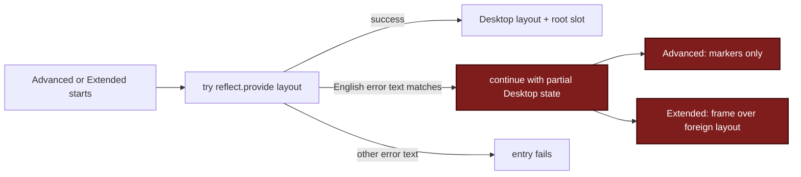
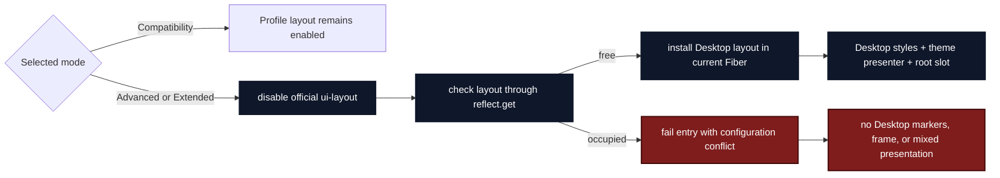

# Agent Note: Desktop client layout ownership

Status: implemented

English | [中文](2026-09-04-desktop-client-layout-ownership.zh.md)

## Problem

Advanced and Extended modes replace the upstream root layout. Profile composition already disables the official `ui-layout` row in those modes, but the Client still treats layout registration as a runtime race.

`claimDesktopLayout()` catches a Cordis exception only when its English message contains `service "layout" has been registered`. The two shells then continue with partial Desktop state:

- Advanced keeps Desktop mode, platform, and material markers but leaves presentation to the existing layout owner.
- Extended keeps the Desktop frame and titlebar over the existing owner's presentation.

That fallback has no complete owner. Window geometry and Desktop markers say one mode is active while another module may own the root layout. A Cordis wording change also turns the same conflict from a fallback into an unhandled error.

## Decision

Profile composition decides layout ownership:

- Compatibility mode keeps the selected profile's layout.
- Advanced and Extended modes disable the official `ui-layout` row and require `dsh-plugin-desktop` to own the `layout` service and root slot.
- An enabled third-party layout in Advanced or Extended mode is a configuration conflict. Desktop fails the shell entry instead of constructing a mixed presentation.

Replace `claimDesktopLayout(): boolean` with an installation interface that has one postcondition: if it returns, Desktop owns `layout`. It checks Cordis through `reflect.get('layout', false)`, reports a Desktop-owned conflict error, and registers the Desktop layout in the current Fiber. Registration failures propagate unchanged.

## Before / after

Before, the Client inferred policy from an implementation detail and both outcomes continued:

After, composition selects the owner and the Client enforces that decision before installing presentation:

## Ownership invariant

For every Client shell apply:

1. Compatibility mode does not register a Desktop layout.
2. Advanced and Extended modes either install the full Desktop presentation or fail the shell entry.
3. A successful Desktop installation owns the `layout` service, Desktop styles, theme presentation, and the root slot in the same apply lifecycle.
4. No branch continues with Desktop mode markers or frame chrome over a foreign layout.
5. Conflict behavior does not depend on Cordis exception wording.

## Verification

Client tests cover effect-scoped disposal, a free layout, an already occupied layout, and unrelated registration failures. Shell tests verify that Advanced and Extended fail before installing partial state when ownership is unavailable. Profile tests continue to prove that Advanced and Extended disable the official layout while Compatibility preserves profile composition.

The focused Client, shell, and profile suites passed in both packages (`69 passed` each). Root typecheck and build passed, as did the architecture and bilingual-document checks. The full Stable suite completed with `1013 passed`, `12 skipped`, and one unrelated failure; Beta completed with `1033 passed`, `12 skipped`, and the same failure. In both packages, `recovery-plugin-uninstall.spec.ts` exits with code 127 because its child process cannot find pnpm. The variant check still reports the existing undeclared line-ending drift in `client/assets.d.ts`, `client/theme-presenter.ts`, and `tray-icons.ts`; none is changed here.

## Consequences

Custom root layouts remain supported in Compatibility mode. A profile that enables another layout provider while selecting Advanced or Extended mode must choose one owner instead of relying on load order. The upstream checkout remains pinned and unmodified.
