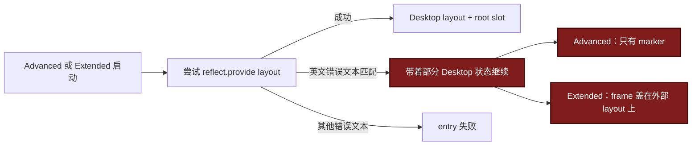
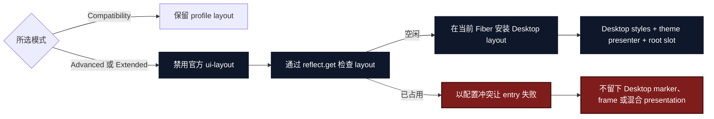

# Agent Note：Desktop Client layout 所有权

状态：已实现

[English](2026-09-04-desktop-client-layout-ownership.md) | 中文

## 问题

Advanced 和 Extended 模式会替换上游 root layout。Profile composition 已经在这两个模式下禁用了官方 `ui-layout` row，但 Client 仍把 layout 注册当成运行时竞争。

`claimDesktopLayout()` 只在 Cordis 异常的英文消息包含 `service "layout" has been registered` 时捕获冲突。之后两个 shell 会带着不完整的 Desktop 状态继续运行：

- Advanced 保留 Desktop mode、platform 和 material marker，但把 presentation 留给已有 layout owner。
- Extended 保留 Desktop frame 和 titlebar，再盖到已有 owner 的 presentation 上。

这种降级没有完整 owner。窗口 geometry 和 Desktop marker 表示一种模式已启用，root layout 却可能由另一个 module 持有。Cordis 只要修改异常文案，同一个冲突还会从“降级”变成未处理错误。

## 决策

由 profile composition 决定 layout 所有权：

- Compatibility 模式保留所选 profile 的 layout。
- Advanced 和 Extended 模式禁用官方 `ui-layout` row，并要求 `dsh-plugin-desktop` 同时拥有 `layout` service 和 root slot。
- Advanced 或 Extended 模式中存在已启用的第三方 layout，属于配置冲突。Desktop 直接让 shell entry 失败，不再拼出混合 presentation。

把 `claimDesktopLayout(): boolean` 改为只有一个后置条件的安装 interface：只要返回，Desktop 就已经拥有 `layout`。它通过 `reflect.get('layout', false)` 检查 Cordis，用 Desktop 自己的错误说明冲突，并在当前 Fiber 中注册 Desktop layout。其他注册失败保持原样向上传播。

## 变更前 / 变更后

变更前，Client 根据一个 implementation detail 推断策略，而且两个结果都会继续运行：

变更后，composition 先选定 owner，Client 在安装 presentation 前执行该决定：

## 所有权不变量

每次 Client shell apply 都满足：

1. Compatibility 模式不注册 Desktop layout。
2. Advanced 和 Extended 模式要么安装完整 Desktop presentation，要么让 shell entry 失败。
3. Desktop 安装成功时，`layout` service、Desktop styles、theme presentation 和 root slot 处于同一个 apply lifecycle。
4. 不再有 Desktop mode marker 或 frame chrome 覆盖外部 layout 的分支。
5. 冲突行为不依赖 Cordis 异常文案。

## 验证

Client 测试覆盖 Fiber-scoped disposal、空闲 layout、已占用 layout 和无关注册失败。Shell 测试验证 Advanced 和 Extended 在无法取得所有权时，先于任何部分状态安装而失败。Profile 测试继续证明 Advanced 和 Extended 会禁用官方 layout，Compatibility 则保留 profile composition。

两套 package 的 Client、shell 和 profile 定点测试均通过（各 `69 passed`）。根目录 typecheck 和 build 通过，architecture 与双语文档检查也通过。Stable 全量测试结果为 `1013 passed`、`12 skipped` 和 1 个无关失败；Beta 为 `1033 passed`、`12 skipped` 和同一个失败。两套 package 都是 `recovery-plugin-uninstall.spec.ts` 的子进程找不到 pnpm，因此以 127 退出。Variant 检查仍会报告已有且未声明的换行差异：`client/assets.d.ts`、`client/theme-presenter.ts` 和 `tray-icons.ts`；本次没有修改这些文件。

## 后果

Compatibility 模式仍支持自定义 root layout。Profile 如果在选择 Advanced 或 Extended 的同时启用另一个 layout provider，就必须明确选择一个 owner，不能再依赖加载顺序。上游 checkout 保持 pinned 且不修改。
