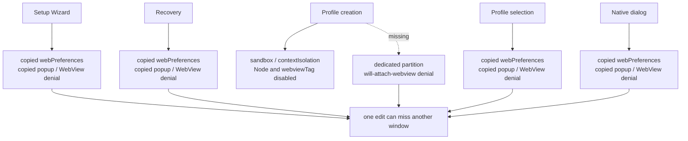
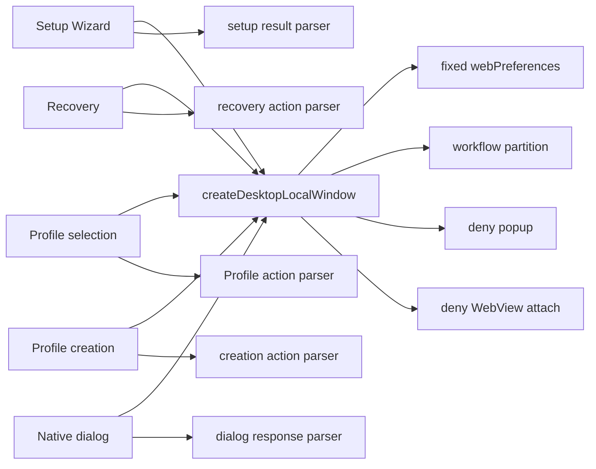

# Agent Note: Desktop local-window security policy

Status: implemented

English | [中文](2026-09-04-desktop-local-window-security-policy.zh.md)

## Problem

Desktop has five window types that load product-owned HTML directly: Setup Wizard, Recovery, Profile selection, Profile creation, and native dialogs. They need no Node access, preload, popup, or WebView, and should not share a session with the main Renderer.

Those rules currently live in five constructors. Profile creation disables `webviewTag`, but has no dedicated `partition` and does not register a `will-attach-webview` denial listener. The other four windows carry those protections but copy them independently. When adding or changing a window, nearby code does not distinguish product security invariants from display options for that particular window.

This is not a confirmed exploit. `webviewTag: false` already disables WebView today. The problem is that equivalent local windows do not cross one seam, so defense rules can drift silently.



## Decision

Add a private `local-window-policy` module with one interface:

```ts
createDesktopLocalWindow({
  partition,
  preferredSizeMode?,
  ...browserWindowOptions
}): BrowserWindow
```

The module constructs the `BrowserWindow` and fixes these rules:

- `contextIsolation: true`;
- `nodeIntegration: false`;
- `nodeIntegrationInSubFrames: false`;
- `sandbox: true`;
- `webSecurity: true`;
- `webviewTag: false`;
- `spellcheck: false`;
- the caller must provide a dedicated non-persistent `partition`;
- every popup returns `deny`;
- every `will-attach-webview` event is prevented;
- the interface accepts no arbitrary `webPreferences` override.

`preferredSizeMode` exists only for native dialogs that consume content-size events. Window dimensions, parent/modal relationships, native frame, reveal timing, allowed custom scheme, and result lifecycle remain with each workflow.



## Unchanged behavior

- The main Renderer remains constructed by `ElectronShellGeneration` with its own loopback navigation and external-link policy.
- Local windows keep their current `loadFile()` documents and custom schemes for bounded results.
- Frame, dimensions, parent relationships, reveal, and disposal behavior stay with each window.
- No preload, IPC, or persistent session is added.

## Verification

Stable and Beta tests fix every security option, verify popup and WebView attach denial, and reject empty, persistent, or non-product partitions. A source-structure test requires all five local window types to construct through the module. Existing tests continue to cover the Profile creation partition, native-dialog preferred-size mode, each action parser, window lifecycle, and platform reveal behavior.

## Consequences

A new local HTML window chooses only its dedicated partition and ordinary window options. Bypassing this seam appears directly as another `new BrowserWindow()` in source inspection. A security-rule change is reviewed in one module and one test group.
