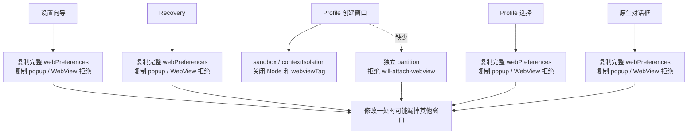
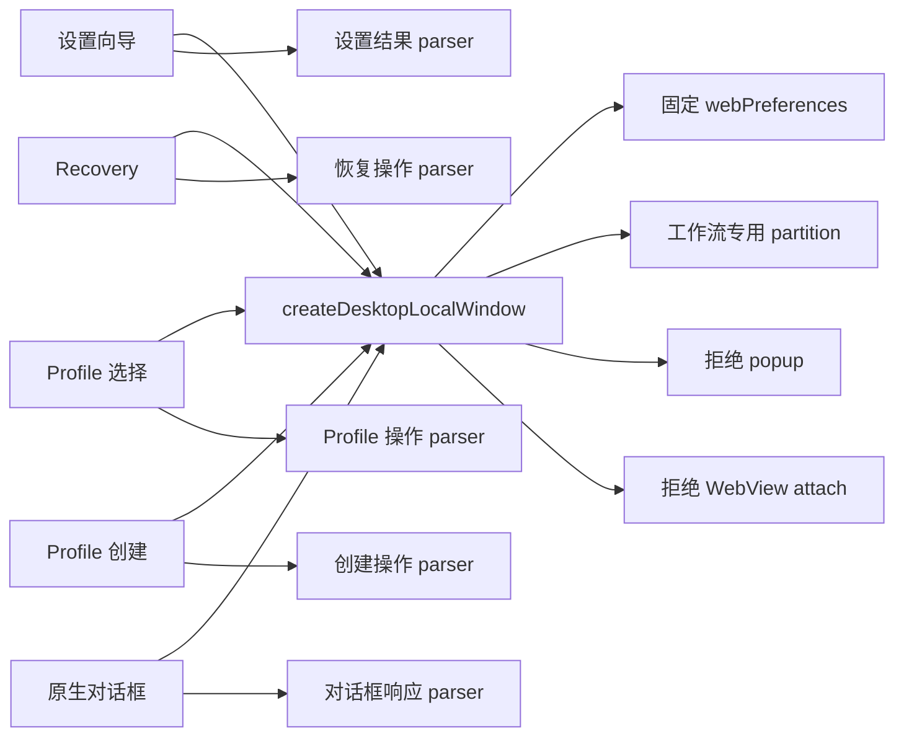

# Agent Note：Desktop 本地窗口安全策略

Status: implemented

[English](2026-09-04-desktop-local-window-security-policy.md) | 中文

## 问题

Desktop 有五类直接加载产品内置 HTML 的窗口：设置向导、Recovery、Profile 选择、Profile 创建和原生对话框。它们都不需要 Node、preload、popup 或 WebView，也不应与主 Renderer 共用 session。

这些规则目前写在五个构造函数里。Profile 创建窗口已经关闭 `webviewTag`，但没有独立 `partition`，也没有注册 `will-attach-webview` 的拒绝监听器。其他四类窗口有这两项保护，但每处都复制了一遍。新增或修改窗口时，只看相邻代码很难知道哪些字段是产品安全不变量，哪些只是当前窗口的显示选项。

这不是已确认的安全利用。当前 `webviewTag: false` 已经关闭 WebView；问题是同类本地窗口没有经过同一个 seam，防御规则可以无声漂移。



## 决策

新增私有 `local-window-policy` module，提供一个 interface：

```ts
createDesktopLocalWindow({
  partition,
  preferredSizeMode?,
  ...browserWindowOptions
}): BrowserWindow
```

该 module 构造 `BrowserWindow`，并固定以下规则：

- `contextIsolation: true`；
- `nodeIntegration: false`；
- `nodeIntegrationInSubFrames: false`；
- `sandbox: true`；
- `webSecurity: true`；
- `webviewTag: false`；
- `spellcheck: false`；
- 调用方必须提供本地窗口专用的非持久化 `partition`；
- 所有 popup 都返回 `deny`；
- 所有 `will-attach-webview` 事件都被阻止；
- interface 不接受任意 `webPreferences` 覆盖。

`preferredSizeMode` 只供需要内容尺寸事件的原生对话框使用。窗口尺寸、parent/modal、原生 frame、显示时机、允许的自定义 scheme 和结果生命周期仍由各自工作流管理。



## 保持不变

- 主 Renderer 继续由 `ElectronShellGeneration` 创建并执行它自己的 loopback 导航和外链策略。
- 本地窗口仍使用现有 `loadFile()` 文档和自定义 scheme 传递有界结果。
- 各窗口的 frame、尺寸、父子关系、显示与销毁行为不变。
- 不新增 preload、IPC 或持久化 session。

## 验证

Stable 和 Beta 的测试固定全部安全选项，验证 popup 与 WebView attach 被拒绝，并拒绝空、持久化或非产品 partition。结构测试要求五类本地窗口都通过该 module 构造。现有测试继续覆盖 Profile 创建的专用 partition、原生对话框的 preferred-size mode、各 action parser、窗口生命周期和平台显示行为。

## 后果

以后新增本地 HTML 窗口时，调用方只选择专用 partition 和普通窗口选项。绕过这条 seam 会在源码检查中直接出现新的 `new BrowserWindow()`；安全规则的变化只需在一个 module 和一组测试中审查。
