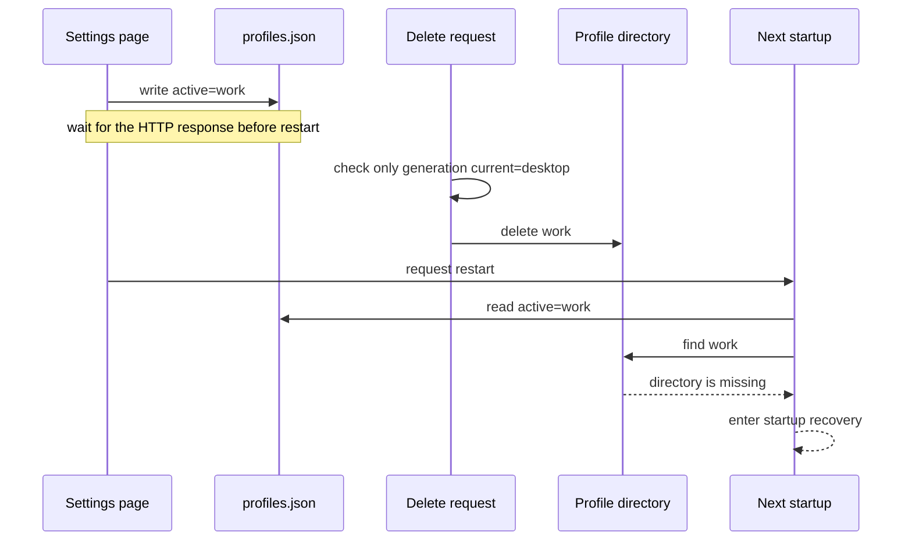
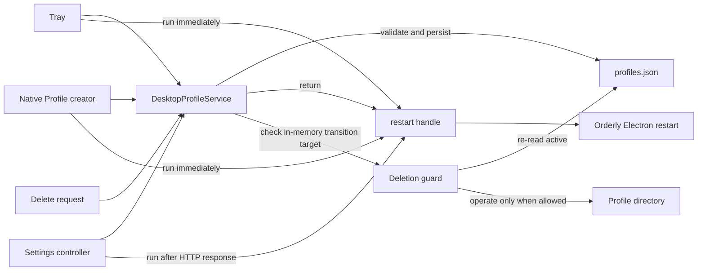

# Agent Note: Desktop Profile transition ownership

Status: implemented

English | [中文](2026-09-04-desktop-profile-transition-ownership.zh.md)

## Problem

Desktop already has `DesktopProfileService`. The tray and native Profile creator switch through it, so only the first successfully persisted target can proceed to restart within one Host generation.

The settings page takes another path. `DesktopSettingsController` checks discovery itself and writes selection state directly. It then defers restart until after the HTTP response. This preserves response ordering but bypasses the concurrency rules in `DesktopProfileService`. Two settings requests can both report acceptance while the later write replaces the earlier target.

Deletion also checks only the Profile that started the current generation. `selectionStatePath` is passed into deletion but never read. After selection is persisted and before restart begins, the new target is still treated as inactive and can be deleted.

The shortest failure path is:

This is not a failure of the atomic `profiles.json` write. Each write is complete. Selection and deletion simply do not obey the same owner.

## Decision

`DesktopProfileService` owns every Profile transition within one Host generation. The settings page no longer receives the raw `persistProfileSelection` capability and no longer decides whether a Profile is selectable.

A transition has two explicit phases:

1. The Profile module validates and persists the target, then returns a restart handle for that transition.
2. The caller runs the restart handle at the appropriate time. The tray and native creator run it immediately; settings runs it after the HTTP response ends.

The restart handle exposes only whether restart is required and how to request that restart. Target ownership, duplicate coalescing, rejection of a different target, release after persistence failure, and same-target retry after restart failure remain inside `DesktopProfileService`.

Deletion keeps a final filesystem-side check. Both `canDeleteDesktopProfile()` and `deleteDesktopProfile()` read `selectionStatePath` and reject a target equal to persisted `active`. The Profile module also blocks deletion of the same target while persistence is still in flight, before an on-disk check can see it.

## Invariants

1. One Host generation accepts only the first successfully persisted non-current Profile.
2. Duplicate requests for the same target share persistence and restart; a different target cannot replace a persisted target.
3. Persistence failure does not request restart and permits a later target to try again.
4. A successful settings response is completed before restart is requested.
5. The current Profile, an in-flight persistence target, and the Profile named by `profiles.json.active` cannot be deleted.
6. Other inactive Profiles remain deletable.

## Unchanged behavior

- Selection state keeps the version 2 single `active` field and the existing atomic write.
- Startup failure remains owned by the current checkpoint and Recovery flow.
- Profile discovery, Profile creation, preference cleanup, and staged directory deletion remain unchanged.
- Market selection keeps its own persistence and restart path.

## Verification

Stable and Beta regression tests cover:

- with two different concurrent targets, only the first successfully persisted target is accepted;
- after settings persistence and before response completion, restart has not been requested;
- a persisted target awaiting restart cannot be deleted;
- deletion of the same target cannot cross the Profile module while persistence is in flight;
- another inactive Profile remains deletable;
- the settings Profile selection entry no longer holds a raw state-writing capability;
- asynchronous restart failure after the response enters the existing error-reporting path.

## Consequences

Profile entry points may still choose when restart is requested, but target selection, concurrency rules, and deletion protection have one owner. A future Profile entry point receives the Profile module transition interface and cannot write `profiles.json` directly.
