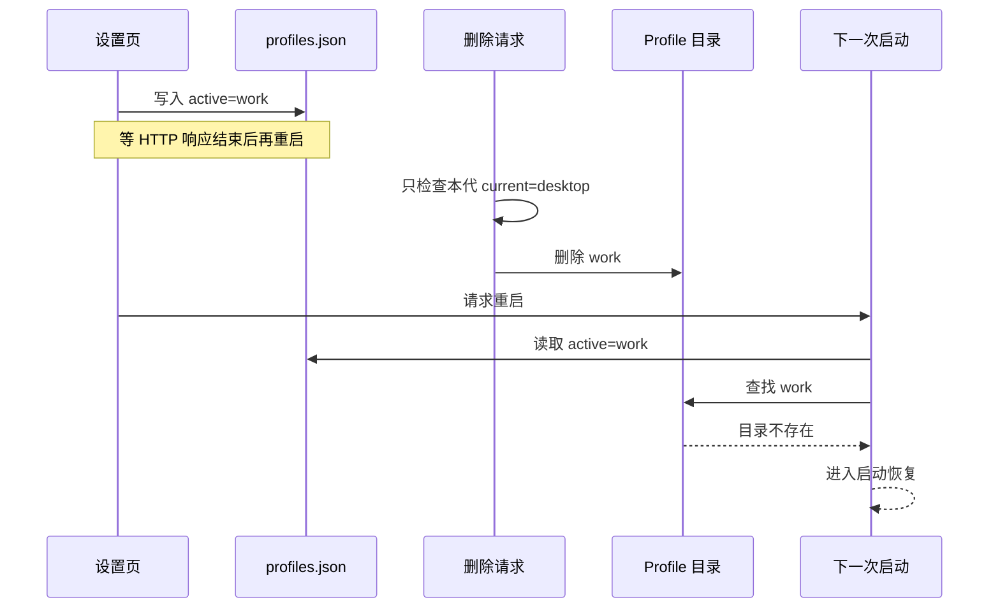
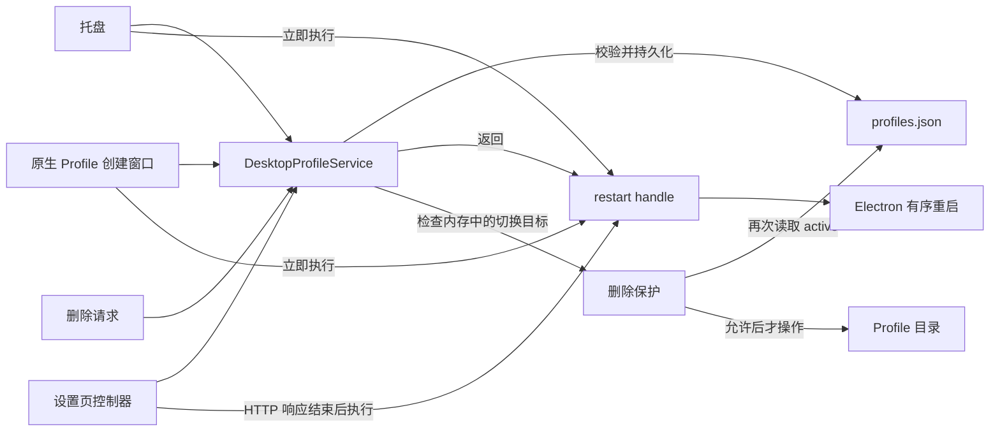

# Agent Note：Desktop Profile 切换所有权

Status: implemented

[English](2026-09-04-desktop-profile-transition-ownership.md) | 中文

## 问题

Desktop 已经有 `DesktopProfileService`。托盘和原生 Profile 创建窗口通过它切换 Profile，因此同一代 Host 内只允许第一个成功持久化的目标继续重启。

设置页走了另一条路。`DesktopSettingsController` 自己检查发现列表，然后直接写选择状态；写完以后，它把重启动作留到 HTTP 响应结束之后。这样虽然保证了响应先发出，却绕过了 `DesktopProfileService` 的并发约束。两个设置请求可能都返回“已接受”，后写入的请求会覆盖前一个目标。

删除也只检查当前 generation 的 Profile 名称。`selectionStatePath` 已经传给删除函数，但没有被读取。选择状态写入后、重启发生前，新的目标仍被当作非当前 Profile，可以被删除。

下面是最直接的失败路径：

这不是 `profiles.json` 原子写入的问题。单次写入是完整的，问题在于选择和删除没有服从同一个所有者。

## 决策

`DesktopProfileService` 负责一代 Host 内所有 Profile 切换。设置页不再接收原始的 `persistProfileSelection` capability，也不再自己判断 Profile 是否可选。

切换分成两个明确阶段：

1. Profile module 校验并持久化目标，返回本次切换的 restart handle。
2. 调用方在合适的时机执行 restart handle。托盘和原生创建窗口立即执行；设置页在 HTTP 响应结束后执行。

restart handle 只暴露“是否需要重启”和“请求本次重启”。目标 Profile、重复请求合并、不同目标拒绝、持久化失败后的释放，以及重启失败后的同目标重试，都留在 `DesktopProfileService` 内。

删除保留文件系统侧的最后检查。`canDeleteDesktopProfile()` 和 `deleteDesktopProfile()` 都读取 `selectionStatePath`；目标等于持久化的 `active` 时拒绝删除。Profile module 还会挡住尚在持久化中的同目标删除，避免删除和选择在状态写入前交错。

## 不变量

1. 同一代 Host 只接受第一个成功持久化的非当前 Profile。
2. 相同目标的重复请求共用同一次持久化和重启；不同目标不能覆盖已经持久化的目标。
3. 持久化失败不会请求重启，并允许后续目标重新尝试。
4. 设置页的成功响应必须先于重启请求。
5. 当前 Profile、正在持久化的目标和 `profiles.json.active` 指向的 Profile 都不能删除。
6. 删除其他非当前 Profile 仍然可用。

## 保持不变

- 选择状态继续使用 version 2 的单一 `active` 字段和现有原子写入。
- 启动失败继续交给当前 checkpoint 与 Recovery 流程处理。
- Profile 发现规则、Profile 创建、偏好清理和目录 staging 删除保持不变。
- Market 选择仍由它自己的持久化与重启路径负责。

## 验证

Stable 和 Beta 的回归测试覆盖：

- 两个不同目标并发选择时，只有第一个成功持久化的目标被接受；
- 设置页持久化后、响应结束前，重启尚未请求；
- 已持久化但尚未重启的目标不能删除；
- 持久化期间的同目标删除不能穿过 Profile module；
- 其他非当前 Profile 仍可删除；
- Profile 选择的设置页入口不再持有原始状态写入 capability；
- 响应结束后的异步重启失败会交给现有错误报告路径。

## 后果

Profile 切换仍然允许不同入口选择各自的重启时机，但目标选择、并发规则和删除保护只有一份。以后新增 Profile 入口时，只能拿到 Profile module 的切换 interface，不能直接写 `profiles.json`。
