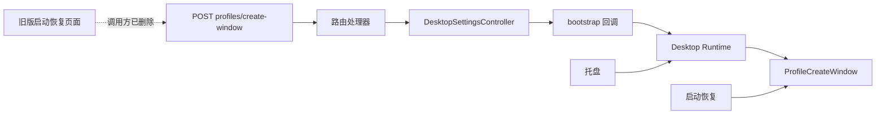
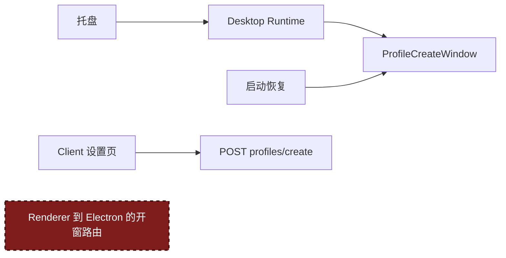

# Agent Note：移除废弃的 Profile 创建窗口路由

状态：已实现

[English](2026-09-04-obsolete-profile-creator-route.md) | 中文

## 问题

`POST /api/desktop/profiles/create-window` 最初供旧版启动恢复页面使用。Renderer 通过它请求 Electron Host 打开 `ProfileCreateWindow`：

启动恢复页面后来改成了单一的“打开恢复模式”操作。原来的 Profile 创建窗口调用被删除，路由及其后面的逐层转发却保留了下来。

当前的 Profile 入口不使用这条链：

- 托盘直接调用 `DesktopRuntime.openProfileCreateWindow()`；
- 启动恢复直接创建 `ProfileCreateWindow`；
- Client 设置页通过 `POST /api/desktop/profiles/create` 创建 Profile 数据。

Desktop settings HTTP interface 是私有接口。Client settings module 没有暴露 `create-window`，项目也没有把它记录为对外契约。

## 决策

删除 `create-window` 路由，以及只为转发该请求而存在的实现：

- 路径常量和请求、响应类型；
- 路由处理器；
- `DesktopSettingsController.openProfileCreator()`；
- bootstrap 的 `openProfileCreator` 回调；
- 路由注册和只覆盖这条路由的测试。

Stable 和 Beta 同步修改。

保留 `ProfileCreateWindow`、托盘与启动恢复入口，以及 `POST /api/desktop/profiles/create`。

修改后，窗口所有权留在 Electron，Profile 数据创建继续使用现有 interface：

## 删除测试

路由处理器、controller method 和 bootstrap callback 没有隐藏策略，也没有提供可复用行为。每一层都只是把同一个操作交给下一层。删掉整条链后，复杂度随之消失；没有调用方需要替代实现，也没有 implementation 被转移到别处。

有实际作用的 module 继续保留。`ProfileCreateWindow` 仍负责原生创建流程，Desktop Runtime 仍是需要打开该窗口的原生调用方所使用的 interface。

## 保持不变

- 托盘仍可打开原生 Profile 创建窗口。
- 启动恢复仍可打开原生 Profile 创建窗口。
- Client 设置页仍可创建 Profile 数据。
- Profile 校验、持久化、选择和重启行为不变。
- pinned upstream checkout 不做修改。

## 兼容性

仓库外如果有代码硬编码调用私有 `create-window` 地址，修改后会收到 `404`。该地址从未是受支持的公开 interface，因此不增加兼容 adapter，也不设置弃用期。

## 验证

旧路径及其路由专属符号在两套 desktop package 中都已归零。Stable 和 Beta 的 settings、启动恢复及 Host plugin 定点测试均通过（各 `59 passed`）。

根目录 typecheck 和 build 通过，architecture 与双语文档检查也通过。Stable 全量测试结果为 `1023 passed`、`12 skipped` 和 1 个无关失败；Beta 为 `1043 passed`、`12 skipped` 和同一个失败。两套 package 都是 `recovery-plugin-uninstall.spec.ts` 的子进程找不到 pnpm，因此以 127 退出。

Variant 检查仍会报告已有且未声明的换行差异：`client/assets.d.ts`、`client/theme-presenter.ts` 和 `tray-icons.ts`；本次没有修改这些文件。

## 后果

Renderer 不再持有用于打开该原生窗口的 HTTP 命令。以后新增原生 Profile 入口时，应调用由 Electron 侧持有的 Profile interface，而不是重新增加 Renderer 到 Electron 的私有透传链。
