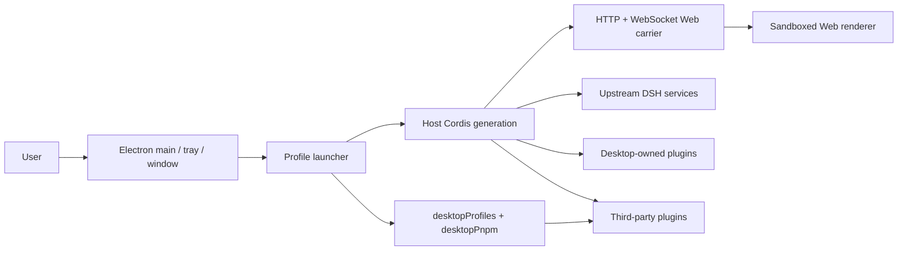

# DSH Desktop Architecture

## Overview

DSH Desktop is a thin Electron host. It starts the official DSH Host in Electron's main process; the Host exposes the ordinary Web UI over an HTTP/WebSocket Web carrier. The carrier listens on loopback by default and can be exposed to the LAN only after the user explicitly acknowledges the risk. Desktop does not create a second renderer IPC plugin system and does not expose raw Electron APIs to the page.

## Startup order

1. Electron acquires the single-instance lock and reads Desktop-owned profile/mode state.
2. The launcher prepares the active profile without modifying profiles merely to list them.
3. The launcher provides the native runtime, the generation's `desktopProfiles` bootstrap, and the bundled pnpm environment.
4. The Host Cordis root mounts Loader entries. Desktop services are registered before third-party entries can consume them.
5. `dsh-base`, `dsh-web-app`, and the selected profile's third-party bundles compose the Web carrier.
6. The Host binds loopback by default or all network interfaces when the confirmed setting requests it; Electron creates the BrowserWindow and loads the same-origin page through the loopback address.
7. The tray is created only after the Web surface loads, and the profile is committed as last-known-good.

Every profile or mode switch disposes the current generation before starting the next one. Service references, window objects, and subprocess handles must not be cached across generations.

## Host, Client, and native runtime

- **Upstream Host** owns agent, model, tool, session, settings, webServer, and subprocess capabilities.
- **Desktop Host** owns the window, tray, profiles, terminal, updates, and the two public Desktop services.
- **Web Client** contains the official Web UI and third-party browser contributions. It works over the shared Web carrier and does not call Electron directly.
- **Native runtime** adapts Electron BrowserWindow, the tray, filesystem/network operations, and installers. `desktopRuntime` is for Desktop-owned rows only.

Compatibility mode validates its environment and adds only an independent 36-pixel Desktop frame through the overlay slot; the official layout, root, sidebar, and conversation remain an unrelated content viewport below it. Extended mode disables the official root layout and installs its own Desktop layout/sidebar registration, which continues to host the official sidebar, conversation, and details occupants inside an inverted-L material frame. Enhanced mode keeps a separate root registration and its original compact internal-caption geometry. macOS and Windows apply capability-gated native materials without changing the ownership of upstream occupant slots.

Desktop-level confirmations, warnings, errors, and results do not enter the Web Client tree. `DesktopDialogWindow` creates a separate sandboxed modal `BrowserWindow`, applies the shared empty utility frame, parents it to the active generation window when possible, and accepts only one bounded local response. Recovery and Profile creation are separate Desktop-owned windows using the same title-free frame. Recovery itself is a shadcn page with reason-first presentation and four workflow tabs; destructive recovery actions delegate their confirmation back to `DesktopDialogWindow`.

### Native shell generation and platform adapters

`ElectronRuntime` coordinates the Host and native desktop environment without directly owning window and tray details. Each start creates one `ElectronShellGeneration` module that completely owns its `BrowserWindow`, `Tray`, related Electron listeners, navigation restrictions, external-link handling, and zoom shortcuts. A generation must be disposed through its idempotent `release()` interface; callers must not cache or destroy those resources separately across generations.

Platform differences live at the `ElectronPlatformStrategy` seam selected once during startup. The Windows, macOS, and Linux adapters declare directory-picking, shell-mode, and update-download capabilities and own their platform-specific menu, Dock icon, and native-material operations. New platform branches belong in the corresponding adapter; the generation and runtime retain only the lifecycle shared across platforms.

## Profile and service boundaries

The profile name and absolute directory come from `desktopProfiles.current`; they must not be inferred from argv, settings, or a URL. `list()` is read-only discovery. `select()` records a pending target and completes the switch through restart.

`desktopPnpm.run()` runs bundled pnpm directly. `runPlugin()` uses packaged DSH CLI semantics so profile initialization, relative sources, and bundle reconciliation remain authoritative. Both operations belong to the current generation and use the subprocess service for complete process-tree ownership.

The launcher-private `desktopRuntime`, `desktopPnpmBootstrap`, Electron executable, Node helpers, and ABI environment are not third-party APIs. The supported public contracts are only `dsh-plugin-desktop/profile-service` and `dsh-plugin-desktop/pnpm`.

## Packaging and runtime closure

Release artifacts use Electron Builder and `app.asar`, while dependencies that must be physical (for example pnpm, node-pty, and Windows ACL/native files) live under `app.asar.unpacked`. The packaged-runtime gate checks both archive entries and physical runtime entries; profile fallback links must not target virtual ASAR paths that Node cannot resolve.

The outer workspace uses Yarn. The pinned `deepseek-harness/` submodule keeps its own pnpm workspace. Desktop source, tests, packaging, and release scripts belong to `dsh-plugin-desktop/`; the upstream submodule is not edited from Desktop branches.

## Maintainer reading

- [Desktop service contract](../dsh-plugin-desktop/docs/plugin-services.md)
- [Package README](../dsh-plugin-desktop/README.md)
- [Pinned upstream and isolated Yarn workspace](../.agents/notes/implemented/process/2026-08-15-pinned-upstream-and-isolated-yarn-workspace.md)
- [Profile and pnpm services decision](../.agents/notes/implemented/architecture/2026-08-15-desktop-profile-and-pnpm-services.md)
- [Advanced shell decision](../.agents/notes/implemented/architecture/2026-08-15-desktop-advanced-shell.md)
- [Native shell generation and platform adapters](../.agents/notes/implemented/architecture/2026-08-19-native-shell-generation-and-platform-adapters.md)
