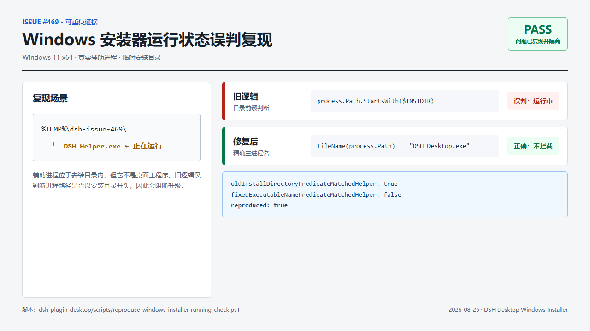
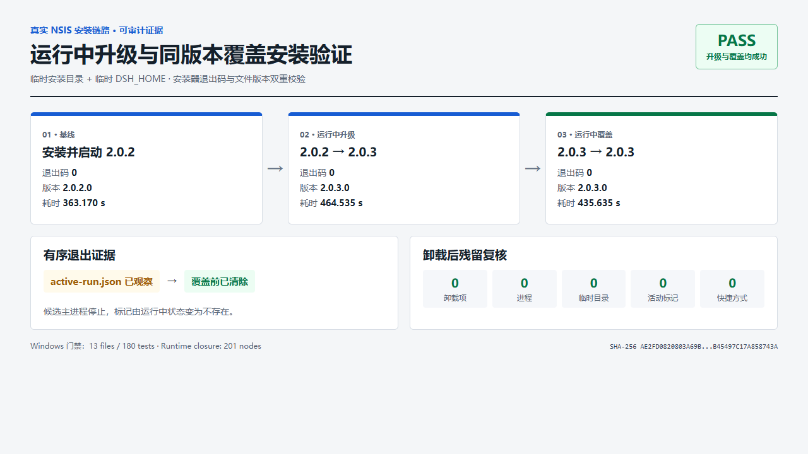

# Windows 安装器升级与覆盖安装修复证据

## 结论

- 结果：通过。
- 范围：仅修改 DSH Desktop 的 Electron/NSIS 安装与退出协调；未修改 `deepseek-harness` 子模块或 DSH 底层。
- 真实安装链路：`2.0.2 -> 2.0.3` 运行中升级通过，`2.0.3 -> 2.0.3` 运行中覆盖安装通过。
- 清理：测试安装目录、卸载注册表项、快捷方式、测试进程、临时目录和活动运行标记均无残留。

## 图像摘要

### #469 误判复现



### 真实升级与覆盖安装



## 关联问题

- Issue: [#469 Windows 更新安装器误判应用仍在运行](https://github.com/anywhere-labs/dsh-desktop/issues/469)
- 已有基础修复：[PR #471](https://github.com/anywhere-labs/dsh-desktop/pull/471)，提交 `edc9574f447c90866e85cfd1d40f718be7737432`，将“安装目录下任意进程”改为精确匹配 `DSH Desktop.exe`。
- 本次补充：安装器先通过 `--dsh-installer-quit` 请求运行中的桌面端有序退出，等待清理完成后再覆盖文件；旧版不支持该参数时，继续使用精确进程名的停止/强制停止回退。

## 测试基线

| 项目 | 值 |
| --- | --- |
| 日期 | 2026-08-25（Asia/Shanghai） |
| 系统 | Microsoft Windows 11 专业版，10.0.26200，64-bit |
| 分支 | `fix/windows-installer-upgrade-evidence` |
| 基线提交 | `2172b1b2f2b0de4c2b3a1d8b55f11f8083a9305e` |
| Node.js | `v24.15.0` |
| Yarn | `4.18.0`（通过 Corepack） |
| DSH 子模块 | `b150a551b8d465e31e418e1b2eaf5e79bbb7d28e`，未修改 |

## 安装器身份

| 安装器 | PE 版本 | 大小（字节） | SHA-256 |
| --- | --- | ---: | --- |
| `DSH-Desktop-2.0.2-x64-Setup.exe` | `2.0.2` | 132417238 | `B31F63F8CF70D3FC07ED2AE36E5DE7B1939E604BDB3BE097DE3383A82A06A787` |
| `DSH-Desktop-2.0.3-x64-Setup.exe` | `2.0.3` | 132758556 | `AE2FD0820803A69B7C953B9831FC029EE06499E07078DC8B45497C17A858743A` |

候选产物：`dsh-plugin-desktop/dist/DSH-Desktop-2.0.3-x64-Setup.exe`。

## 问题复现

执行：

```powershell
& .\dsh-plugin-desktop\scripts\reproduce-windows-installer-running-check.ps1
```

脚本在临时“安装目录”中启动真实的 `DSH Helper.exe` 进程，并比较旧目录前缀判断与修复后的精确名称判断：

```json
{
  "oldInstallDirectoryPredicateMatchedHelper": true,
  "fixedExecutableNamePredicateMatchedHelper": false,
  "reproduced": true
}
```

这证明旧逻辑会把安装目录内的无关辅助进程误判为桌面主程序，而精确匹配不会。

## 有序退出运行时探针

执行：

```powershell
& .\dsh-plugin-desktop\scripts\probe-windows-installer-quit.ps1 `
  -CandidateApp .\dsh-plugin-desktop\dist\win-unpacked\DSH Desktop.exe
```

结果：

```json
{
  "candidateVersion": "2.0.3.0",
  "primaryProcessId": 50372,
  "activeRunMarkerObserved": true,
  "quitRequestExitCode": 0,
  "primaryProcessStopped": true,
  "activeRunMarkerCleared": true,
  "testRootRemoved": true,
  "error": null,
  "success": true
}
```

探针的主实例和退出请求实例使用相同的临时 Electron `userData`，验证单实例事件能够触发 Cordis/桌面运行时的有序退出，并在退出前清除 `active-run.json`。

## 真实升级与覆盖安装

执行：

```powershell
& .\dsh-plugin-desktop\scripts\smoke-windows-installer-upgrade.ps1 `
  -BaseInstaller E:\qwq\DSHPLU\DSH-desktop\DSH-Desktop-2.0.2-x64-Setup.exe `
  -CandidateInstaller .\dsh-plugin-desktop\dist\DSH-Desktop-2.0.3-x64-Setup.exe
```

安装位置和 `DSH_HOME` 使用 `%TEMP%\dsh-installer-upgrade-<GUID>`。为与生产安装器的单实例身份一致，Electron 使用当前 Windows 账户的默认 `userData`；脚本在开始前要求不存在活动运行标记，并在最终清理中再次验证标记不存在。

| 阶段 | 进程状态 | 退出码 | 耗时 | 文件版本 |
| --- | --- | ---: | ---: | --- |
| 安装基线 | 安装后启动 PID `20288` | 0 | 363170 ms | `2.0.2.0` |
| 运行中升级 | 旧版进程已停止 | 0 | 464535 ms | `2.0.3.0` |
| 启动候选 | 启动 PID `42716`，观察到活动标记 | - | - | `2.0.3.0` |
| 运行中同版本覆盖 | 候选进程已停止，活动标记已清除 | 0 | 435635 ms | `2.0.3.0` |
| 静默卸载 | 完成 | 0 | - | - |

最终 JSON 关键字段：

```json
{
  "baseInstallExitCode": 0,
  "baseInstalledVersion": "2.0.2.0",
  "baseProcessStarted": true,
  "upgradeExitCode": 0,
  "upgradedVersion": "2.0.3.0",
  "baseProcessStopped": true,
  "candidateProcessStarted": true,
  "activeRunMarkerObserved": true,
  "overwriteExitCode": 0,
  "overwriteVersion": "2.0.3.0",
  "candidateProcessStopped": true,
  "activeRunMarkerCleared": true,
  "uninstallExitCode": 0,
  "installRootRemoved": true,
  "uninstallEntryRemoved": true,
  "shortcutsRemoved": true,
  "testProcessesRemaining": 0,
  "activeRunMarkerAbsentAfterCleanup": true,
  "error": null,
  "success": true
}
```

`2.0.2` 不识别新退出参数，因此首次升级按设计走精确主进程名回退；`2.0.3` 同版本覆盖观察到标记从存在变为清除，证明新版本走了有序退出路径。

## 自动化回归

执行：

```powershell
corepack yarn check:win-package
```

结果：

- 构建通过。
- TypeScript 类型检查通过。
- Windows 打包门禁：13 个测试文件、180 个测试全部通过。
- 运行时闭包单测：4/4 通过。
- 运行时闭包：201 个一方节点形成闭合、可达的运行图。
- `git diff --check` 通过。

## 最终残留复核

```json
{
  "InstallEntries": 0,
  "Processes": 0,
  "TestTempRoots": 0,
  "ActiveRunMarkerPresent": false,
  "Shortcuts": 0
}
```

候选安装器未做代码签名验证；本报告用 PE 版本、文件大小和 SHA-256 固定被测二进制身份。
