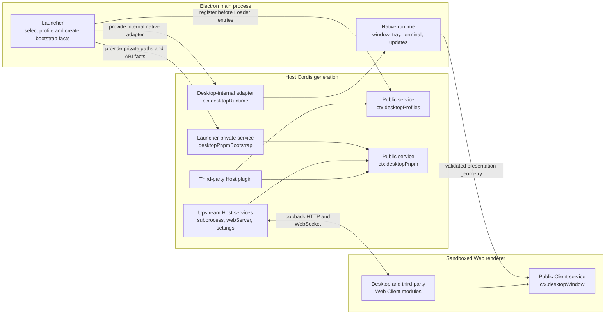

# DSH Desktop plugin services

English | [中文](plugin-services.zh.md)

This document is the supported integration contract for plugin authors. It covers the public Host services `desktopProfiles` and `desktopPnpm`, plus the Client service `desktopWindow`, exported by DSH Desktop 2.x in compatibility, extended, and advanced presentation modes. It does not grant third-party access to raw Electron APIs or launcher bootstrap state.

## Layers and data flow



The launcher resolves one profile before the Loader tree mounts. `desktopProfiles.current` remains fixed until that whole Cordis generation is disposed. The `desktop-pnpm` Host row builds `desktopPnpm` from launcher-private facts and the upstream subprocess service. A profile or mode switch disposes the current generation and starts a new one; service references must not cross that boundary.

The renderer receives ordinary Web Client modules over the existing loopback carrier. It cannot read the Host services directly, and DSH Desktop adds no preload or Electron IPC bridge for them. Instead, the Desktop Client provides immutable native-layout facts through `desktopWindow` for its own Cordis-fiber lifetime. A plugin with browser UI continues to use normal DSH Host routes, RPC, client metadata, services, and slots.

## Public Client Cordis service

Import the Client contract from the supported client export and inject `desktopWindow` only in browser-side code:

```ts
import type { ClientContext } from '@deepseek-ai/dsh-client-runtime/client'
import type { DesktopWindowService } from 'dsh-plugin-desktop/client'

export const inject = ['desktopWindow']

export function apply(ctx: ClientContext): void {
  const geometry: DesktopWindowService = ctx.desktopWindow
  document.documentElement.style.setProperty(
    '--example-desktop-safe-top',
    `${geometry.safeAreaInsets.top}px`,
  )
}
```

### `desktopWindow`

```ts
interface DesktopWindowService {
  readonly mode: 'compatibility' | 'extended' | 'advanced'
  readonly platform: 'darwin' | 'win32' | 'linux'
  readonly material: 'off' | 'transparent' | 'acrylic' | 'mica'
  readonly micaSupported: boolean
  readonly availableMaterials: readonly ('off' | 'transparent' | 'acrylic' | 'mica')[]
  readonly safeAreaInsets: {
    readonly top: number
    readonly right: number
    readonly bottom: number
    readonly left: number
  }
  readonly dragRegion: {
    readonly height: number
    readonly leftInset: number
    readonly rightInset: number
  }
}
```

All values remain fixed for one renderer generation, and geometry uses CSS pixels. `material` is the effective, capability-gated backdrop rather than merely the persisted preference. `availableMaterials` is `off/transparent` on macOS, `off/acrylic` on Windows 10, and adds `mica` on Windows 11 build 22621 or newer.

Compatibility and extended modes report the same 36-pixel top reservation and drag band on macOS and Windows; they exclude 80 pixels on the left for macOS traffic lights or 138 pixels on the right for Windows caption controls. Desktop shifts the complete official frame below this reservation in compatibility mode. Extended instead owns the root layout/sidebar surface and hosts the official sidebar, conversation, and details occupants below the same reservation, so ordinary occupants must not add it again. Linux compatibility keeps its ordinary native frame and therefore reports zero insets and a zero-height drag region. Advanced mode has independent compact geometry: macOS reports a 20-pixel content inset and 32-pixel drag band with an 80-pixel left exclusion, while Windows reports a 32-pixel content inset and drag band with a 138-pixel right exclusion.

`safeAreaInsets` describes where Desktop starts the complete upstream content surfaces. `dragRegion` separately describes the native caption hit area, so consumers must not assume that the two heights are equal. Interactive elements inside that band must apply `-webkit-app-region: no-drag`; Desktop already applies this exclusion to standard buttons, links, inputs, editable fields, menus, tabs, switches, and dialogs. The service reports geometry only: it does not expose window mutation, focus, Electron, or IPC capabilities. It is absent from an ordinary browser boot.

Compatibility and extended modes keep the command bar private to Desktop. They do not declare a titlebar action slot, and the first-party icon group is rendered directly by the Desktop frame: on the right on macOS and on the left on Windows. Web Client plugins must use their documented content slots and cannot place controls beside these native actions. Renderer reload and Developer Tools toggling remain private first-party launcher operations, not additions to the public `desktopWindow` service.

Desktop marks the command bar with `data-dsh-desktop-frame="titlebar"` and the upstream root with `data-dsh-desktop-content-viewport`. The root is a separate fixed viewport below the command bar, so fixed descendants cannot escape into Desktop chrome. Full-viewport dialogs portalled directly to `document.body` receive the same content offset. Body-level plugin portals can read the `dsh-desktop-titlebar-inset` URL contract; framed modes publish the exact 36-pixel reservation. Plugins must not compensate for a boundary they already consume.

## Public Host Cordis services

Use type-only imports from the supported contract paths:

```ts
import type {
  DesktopCurrentProfile,
  DesktopProfiles,
} from 'dsh-plugin-desktop/profile-service'
import type {
  DesktopPnpm,
  DesktopPnpmHandle,
  DesktopPnpmOutcome,
} from 'dsh-plugin-desktop/pnpm'
```

`dsh-plugin-desktop/profiles` is the Desktop-owned tray consumer, not the profile service contract. Do not import it for service types.

### `desktopProfiles`

```ts
interface DesktopProfiles {
  readonly current: {
    readonly name: string
    readonly dir: string
  }
  list(): readonly DesktopProfileSummary[]
  select(name: string): Promise<void>
}
```

- `current` is immutable for one generation. `name` is the launcher-selected profile name and `dir` is its absolute manifest directory. Do not infer either value from argv, `ctx.baseUrl`, settings, Loader rows, or `$DSH_HOME`.
- `list()` re-reads profile manifests without changing their patches, dependencies, or bundle order. Entries can describe profiles that are visible but not selectable.
- `select(name)` is a restart operation, not an in-place mutation. It persists an accepted target before requesting orderly Cordis teardown and Electron relaunch.
- Concurrent calls for the same target share one operation. After a target has been committed as pending, a different target is rejected until restart. A persistence failure releases the selection slot; a restart failure retains the committed target so the same restart can be retried without overwriting state.
- Calls through a retained reference fail after service disposal. Read `current` again from the next generation instead of caching the old service globally.

### `desktopPnpm`

```ts
interface DesktopPnpm {
  run(argv: readonly string[], signal?: AbortSignal): DesktopPnpmHandle
  runPlugin(argv: readonly string[], invokingDir: string, signal?: AbortSignal): DesktopPnpmHandle
  runExternalMarketPluginInstall(
    argv: readonly string[],
    invokingDir: string,
    signal?: AbortSignal,
  ): DesktopPnpmHandle
}

interface DesktopPnpmHandle {
  readonly stdout: NodeJS.ReadableStream
  readonly stderr: NodeJS.ReadableStream
  readonly done: Promise<{
    readonly exitCode: number | null
    readonly signal: NodeJS.Signals | null
  }>
  cancel(): void
}
```

The actual stream type is Node's `Readable`. Every method validates non-empty, NUL-free argv. `run()` always uses the active Profile directory as `cwd`; the plugin adapters require an absolute caller-owned working directory.

| Method | Process and working directory | Supported purpose |
| --- | --- | --- |
| `run(argv, signal?)` | Runs the packaged pnpm JavaScript entry directly, with the active Profile directory as `cwd`. | Any caller-owned pnpm operation. |
| `runPlugin(argv, invokingDir, signal?)` | Runs packaged `dsh plugin --profile <active>` with the supplied plugin argv from an absolute caller directory. | Compatibility adapter for plugin managers that rely on DSH bundle reconciliation. |
| `runExternalMarketPluginInstall(argv, invokingDir, signal?)` | Uses the same packaged DSH plugin CLI but accepts only `add`, flag-style options, and one exact-version npm target. | Narrow compatibility adapter for the bundled `dshmarket` runtime. |

New integrations should prefer direct pnpm argv, for example:

```ts
['add', '--save-exact', 'example-plugin@1.0.0']
['remove', 'example-plugin']
['install', '--no-frozen-lockfile']
```

For `run()`, the caller owns package identity policy, command construction, `dsh.profile.bundles` reconciliation, receipts, and post-operation validation. The compatibility adapters delegate bundle reconciliation to the packaged DSH CLI. None of the three methods snapshots, rolls back, retries, protects, or records package operations. Desktop recovery is independent: each healthy startup writes one of three rotating configuration checkpoints covering the active Profile plus shared Harness-home settings and patches, and the user may explicitly restore an exact slot from Recovery.

The service starts at most one package operation per generation. A second call while one is active throws synchronously. It exposes output instead of choosing a progress UI, and it has no built-in timeout. The consumer owns deadlines, reads both streams, reports progress, calls `cancel()` or aborts its signal when needed, awaits `done`, and checks both `exitCode` and `signal`.

Invalid argv, a closed or busy generation, and a signal that was already aborted all throw synchronously before a handle is returned. After a handle exists, cancellation and generation teardown target the complete subprocess tree. `done` does not settle merely because the direct wrapper exits; the operation gate remains held until descendants are gone. An asynchronous spawn-level failure rejects `done`, while a normal command failure resolves it with a nonzero exit code. Desktop process-locally adds exactly one `--config.minimumReleaseAge=0` at the final pnpm boundary, including packaged `dsh plugin` forwarding and terminal shims, without persisting a user configuration change. On Windows the provider launches the exact packaged pnpm entry with argv and delegates tree ownership to the subprocess service, so plugin authors do not need to discover `.cmd` shims or concatenate shell text.

## Internal and launcher-private capabilities

| Name | Boundary | Plugin-author status |
| --- | --- | --- |
| `desktopProfiles` | Generation-scoped Host service. | Public and supported through `dsh-plugin-desktop/profile-service`. |
| `desktopPnpm` | Generation-scoped Host service. | Public and supported through `dsh-plugin-desktop/pnpm`. |
| `desktopWindow` | Generation-scoped Client service. | Public and supported through `dsh-plugin-desktop/client`; immutable geometry only. |
| `desktopRuntime` | Launcher-provided native adapter used by Desktop-owned shell, tray, terminal, profile, and update rows. | Desktop-internal. Third-party plugins must not inject it or rely on its window/tray methods. |
| `desktopPnpmBootstrap` | Absolute packaged paths, selected profile facts, Electron ABI values, and private Node helpers supplied to the `desktop-pnpm` provider. | Launcher-private. Never read, provide, intercept, or declare it as a dependency. |
| `DesktopProfileServiceBootstrap` | Constructor input used while the launcher registers `desktopProfiles`; it is not a Cordis service. | Launcher-private implementation detail. |

The fact that a private type is present in emitted declarations does not make its runtime service a supported third-party capability. The two public service names and their contract modules are the compatibility boundary.

## Injection patterns

### Desktop-only plugin: required injection

A plugin that only makes sense inside DSH Desktop can declare both services as required dependencies. Cordis keeps the plugin pending until both providers are available and unloads its effects if a required service disappears.

```ts
import type { Context } from '@deepseek-ai/cordis'
import type {} from 'dsh-plugin-desktop/profile-service'
import type { DesktopPnpmHandle } from 'dsh-plugin-desktop/pnpm'

export const name = 'example-desktop-plugin-manager'
export const inject = ['desktopProfiles', 'desktopPnpm']

declare function registerInstallAction(
  callback: (target: string) => Promise<void>,
): () => void
export function apply(ctx: Context): void {
  ctx.logger.info(`active Desktop profile: ${ctx.desktopProfiles.current.name}`)
  ctx.effect(() => {
    let active: DesktopPnpmHandle | undefined
    const disposeAction = registerInstallAction(async (target) => {
      // Validate target first. This callback represents an explicit user action.
      const signal = AbortSignal.timeout(5 * 60_000)
      const operation = ctx.desktopPnpm.run(['add', '--save-exact', `${target}@1.0.0`], signal)
      active = operation
      operation.stdout.setEncoding('utf8')
      operation.stderr.setEncoding('utf8')
      operation.stdout.on('data', chunk => ctx.logger.info(String(chunk).trimEnd()))
      operation.stderr.on('data', chunk => ctx.logger.warn(String(chunk).trimEnd()))
      try {
        const outcome = await operation.done
        if (outcome.exitCode !== 0) {
          throw new Error(`plugin install failed: exit=${String(outcome.exitCode)} signal=${String(outcome.signal)}`)
        }
      } finally {
        if (active === operation) active = undefined
      }
    })
    return async () => {
      disposeAction()
      const operation = active
      operation?.cancel()
      await operation?.done.catch(() => {})
    }
  }, 'example: package-manager user action')
}
```

In production, validate `target` against the plugin's trust policy before invoking a package manager. A process exit code of zero does not replace domain-specific post-install validation.

### Cross-environment plugin: optional Desktop adapter and ordinary DSH fallback

Do not put Desktop services in the top-level required `inject` list when the same package must activate under ordinary DSH. The launcher registers `desktopProfiles` before Loader entries mount, so its presence is the Desktop environment discriminator. If present, create a nested `ctx.inject()` callback that waits for `desktopPnpm`; if absent, mount the existing ordinary DSH implementation.

```ts
import type { Context } from '@deepseek-ai/cordis'
import type {} from 'dsh-plugin-desktop/profile-service'
import type {} from 'dsh-plugin-desktop/pnpm'

export const name = 'cross-environment-plugin-manager'
export const inject = ['webServer', 'loader']

interface ManagerAdapter {
  readonly profile: string
  readonly profileDir?: string
  runPnpm(argv: readonly string[], signal?: AbortSignal): unknown
}

declare function mountManager(ctx: Context, adapter: ManagerAdapter): () => void
declare function ordinaryDshAdapter(profile: string): ManagerAdapter

export function apply(ctx: Context, config: { profile?: string }): void {
  const profiles = ctx.get('desktopProfiles')
  if (profiles === undefined) {
    // Existing non-Desktop behavior remains authoritative here.
    const profile = config.profile ?? 'web'
    ctx.effect(
      () => mountManager(ctx, ordinaryDshAdapter(profile)),
      'example: ordinary DSH plugin manager',
    )
    return
  }

  // ctx.inject() still treats desktopPnpm as required for this nested
  // callback. The parent plugin remains loadable in ordinary DSH because the
  // Desktop-only dependency is not in its top-level inject list.
  ctx.inject(['desktopPnpm'], (desktopCtx) => {
    desktopCtx.effect(() => mountManager(desktopCtx, {
      profile: profiles.current.name,
      profileDir: profiles.current.dir,
      runPnpm: (argv, signal) => desktopCtx.desktopPnpm.run(argv, signal),
    }), 'example: Desktop plugin manager')
  })
}
```

`ctx.inject()` is not an optional-dependency declaration: every name passed to that callback is required for the callback. It is useful here because only the nested Desktop adapter waits for `desktopPnpm`; the outer plugin still owns the ordinary fallback. For a purely additive Desktop feature, the same nested pattern can simply contribute effects while the services exist and do nothing elsewhere.

Never fall back to a guessed `web` profile after `desktopProfiles` is present. A partial or failed Desktop provider set is a Desktop generation failure, not permission to mutate another profile through an ambient CLI. Also do not use `ctx.baseUrl`, settings, Loader inventory, or the launcher's inner `cmdlineArgs` as a substitute for `desktopProfiles.current`.

Type-only imports are erased from JavaScript. A cross-environment package can keep `dsh-plugin-desktop` as a development dependency for compilation, or as an optional peer if it publishes declarations that expose these types; it does not need a runtime import merely to probe the services.

## Minimal runnable test plugin

The repository includes a two-file profile-local fixture at [`tests/fixtures/desktop-host-services-smoke-plugin`](../tests/fixtures/desktop-host-services-smoke-plugin/). Its entry declares `inject = ['desktopProfiles', 'desktopPnpm']`, reads `desktopProfiles.current`, and confirms that `run()` is available. It only publishes the result as a test probe; it never executes pnpm or changes a profile.

The complete Profile Loader smoke copies that package into a temporary profile's `node_modules`, loads it as a normal bare-package Loader entry, and fails unless the probe reports the active profile and `run()`. Run it with:

```sh
yarn workspace dsh-plugin-desktop build
yarn workspace dsh-plugin-desktop verify:profile
```

This fixture is under `tests/`, is absent from the npm `files` list and Electron build files, and never enters a production archive.

## Failure and teardown checklist

1. Start package mutations only from an explicit user or administrator action.
2. Use `desktopProfiles.current` as one snapshot; do not retain the service across restart.
3. Prefer explicit pnpm argv through `run(argv, signal?)`; use a plugin adapter only when compatibility requires DSH bundle reconciliation.
4. Reconcile Profile bundles and validate domain state in the caller after pnpm completes.
5. Supply an `AbortSignal` for the user-facing deadline and retain the handle for explicit cancellation.
6. Drain stdout and stderr, but bound any in-memory history used by a status endpoint.
7. Await `done`; handle rejection, nonzero `exitCode`, and terminating `signal` separately.
8. Surface the generation-wide busy error instead of starting concurrent profile mutations.
9. Cancel active work from the owning Cordis effect disposer and wait for its completion when coordinating teardown.
10. Treat `desktopProfiles.select()` as a restart boundary. Do not continue assuming the selected target is live in the old generation.

## Bundled dshmarket adapter

The bundled `dshmarket` runtime consumes `runPlugin()` for ordinary plugin commands and `runExternalMarketPluginInstall()` for an exact npm add. The latter resolves the version before it crosses the service and rejects non-exact or multi-target requests. Both operations use the active Desktop Profile and the packaged DSH CLI; neither creates an install transaction, snapshot, receipt, automatic rollback, or recovery prompt.

## Stability boundary

The supported plugin-author surface is the `desktopProfiles`, `desktopPnpm`, and `desktopWindow` service contract described here and exported by `dsh-plugin-desktop/profile-service`, `dsh-plugin-desktop/pnpm`, and `dsh-plugin-desktop/client`. Launcher bootstrap values, native adapters, generated shims, state-file formats, Loader row ordering, and Electron implementation details may change without becoming third-party APIs. Keep fallbacks explicit, lifecycle-scoped, and headless-safe.
