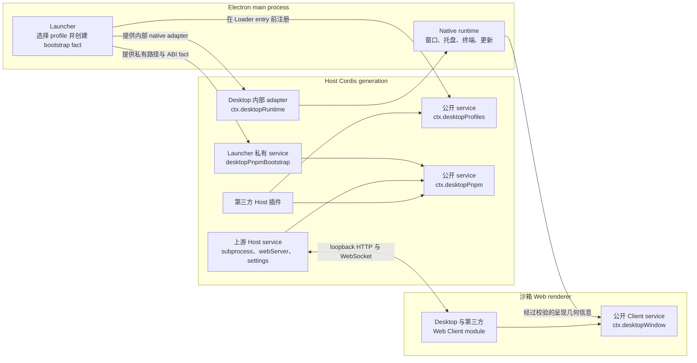

# DSH Desktop 插件 service

[English](plugin-services.md) | 中文

本文档是面向插件作者、受支持的集成 contract，覆盖 DSH Desktop 2.x 在兼容、扩展窗口与增强三种呈现模式下导出的 Host 公开 service `desktopProfiles`、`desktopPnpm`，以及 Client 公开 service `desktopWindow`。它不会授予第三方访问原始 Electron API 或 launcher bootstrap 状态的能力。

## 分层与数据流



Launcher 会在 Loader tree 挂载前解析一个 profile。`desktopProfiles.current` 在整个 Cordis generation dispose 前保持不变。`desktop-pnpm` Host row 会根据 launcher 私有 fact 与上游 subprocess service 构造 `desktopPnpm`。切换 profile 或模式会 dispose 当前 generation 并启动新 generation；service reference 不能跨越该边界。

Renderer 通过现有 loopback carrier 接收普通 Web Client module，无法直接读取这些 Host service；DSH Desktop 也不会为它们增加 preload 或 Electron IPC bridge。Desktop Client 会改为在自己的 Cordis fiber 生命周期内，通过 `desktopWindow` 提供不可变的原生布局信息。包含浏览器 UI 的插件继续使用普通 DSH Host route、RPC、client metadata、service 与 slot。

## 公开 Client Cordis service

从受支持的 client export 导入 contract，并且只在浏览器侧代码中 inject `desktopWindow`：

```ts
import type { ClientContext } from '@deepseek-ai/dsh-client-runtime/client'
import type { DesktopWindowService } from 'dsh-plugin-desktop/client'

export const inject = ['desktopWindow']

export function apply(ctx: ClientContext): void {
  const geometry: DesktopWindowService = ctx.desktopWindow
  document.documentElement.style.setProperty(
    '--example-desktop-safe-top',
    `${geometry.safeAreaInsets.top}px`,
  )
}
```

### `desktopWindow`

```ts
interface DesktopWindowService {
  readonly mode: 'compatibility' | 'extended' | 'advanced'
  readonly platform: 'darwin' | 'win32' | 'linux'
  readonly material: 'off' | 'transparent' | 'acrylic' | 'mica'
  readonly micaSupported: boolean
  readonly availableMaterials: readonly ('off' | 'transparent' | 'acrylic' | 'mica')[]
  readonly safeAreaInsets: {
    readonly top: number
    readonly right: number
    readonly bottom: number
    readonly left: number
  }
  readonly dragRegion: {
    readonly height: number
    readonly leftInset: number
    readonly rightInset: number
  }
}
```

所有值都会在一个 renderer generation 内保持不变，几何值使用 CSS 像素。`material` 是经过系统能力门槛解析后的实际材质，而不只是持久化的偏好。macOS 的 `availableMaterials` 为 `off/transparent`；Windows 10 为 `off/acrylic`；Windows 11 build 22621 及以上还会加入 `mica`。

兼容模式与扩展窗口在 macOS 与 Windows 上都报告顶部 36 像素的预留区与拖动带，并在 macOS 左侧为红绿灯排除 80 像素，或在 Windows 右侧为原生标题栏按钮排除 138 像素。兼容模式会把完整官方 frame 下移到该区域下方。扩展窗口则由 Desktop 持有 root layout/sidebar surface，并在同一预留区下方承载官方 sidebar、conversation 与 details occupant，因此普通 occupant 不能再次叠加这一 inset。Linux 兼容模式保留普通原生 frame，因此报告零 inset 和零高度拖动区域。增强模式使用独立的紧凑几何：macOS 报告 20 像素内容 inset、32 像素拖动带与 80 像素左侧排除；Windows 报告 32 像素内容 inset、32 像素拖动带与 138 像素右侧排除。

`safeAreaInsets` 描述 Desktop 从哪里开始放置完整的上游内容 surface；`dragRegion` 则单独描述原生标题栏命中区域，consumer 不能假设两者高度相同。拖动带内的交互元素必须设置 `-webkit-app-region: no-drag`；Desktop 已经为标准按钮、链接、输入框、可编辑字段、菜单、标签页、开关与对话框设置该排除规则。该 service 只报告几何信息，不提供窗口 mutation、焦点、Electron 或 IPC capability；普通浏览器启动中不存在该 service。

兼容模式与扩展窗口都会让操作栏保持 Desktop 私有。它们不会声明标题栏 action slot；第一方图标组由 Desktop frame 直接渲染，在 macOS 位于右侧、在 Windows 位于左侧。Web Client 插件必须使用各自已有文档的内容 slot，不能把控件放到这些原生操作旁边。Renderer 重载与开发者工具切换仍是第一方私有 launcher 操作，不会加入公开的 `desktopWindow` service。

Desktop 会用 `data-dsh-desktop-frame="titlebar"` 标记操作栏，并用 `data-dsh-desktop-content-viewport` 标记上游 root。Root 会成为操作栏下方独立的 fixed viewport，因此 fixed descendant 不能逃逸到 Desktop chrome；直接 portal 到 `document.body` 的全视口对话框会获得相同的内容偏移。Body 级插件 portal 可以读取 `dsh-desktop-titlebar-inset` URL contract，带 frame 的模式会发布精确的 36px 预留。插件不能重复补偿已经消费的边界。

## 公开 Host Cordis service

请从受支持的 contract 路径执行 type-only import：

```ts
import type {
  DesktopCurrentProfile,
  DesktopProfiles,
} from 'dsh-plugin-desktop/profile-service'
import type {
  DesktopPnpm,
  DesktopPnpmHandle,
  DesktopPnpmOutcome,
} from 'dsh-plugin-desktop/pnpm'
```

`dsh-plugin-desktop/profiles` 是 Desktop 自有托盘 consumer，不是 profile service contract。不要从该路径导入 service 类型。

### `desktopProfiles`

```ts
interface DesktopProfiles {
  readonly current: {
    readonly name: string
    readonly dir: string
  }
  list(): readonly DesktopProfileSummary[]
  select(name: string): Promise<void>
}
```

- `current` 在一个 generation 内不可变。`name` 是 launcher 选择的 profile 名称，`dir` 是其 manifest 绝对目录。不要从 argv、`ctx.baseUrl`、settings、Loader row 或 `$DSH_HOME` 推断两者。
- `list()` 会重新读取 profile manifest，但不会改变 patch、dependency 或 bundle 顺序。返回项可以描述可见但不可选择的 profile。
- `select(name)` 是重启 operation，不是就地 mutation。它会先持久化被接受的目标，再请求有序 Cordis teardown 与 Electron relaunch。
- 同一目标的并发调用会共享一个 operation。目标被提交为 pending 后，其它目标会在重启前被拒绝。持久化失败会释放选择 slot；重启失败则保留已提交目标，使同一个 restart 可以重试而不会覆盖状态。
- Service dispose 后，通过保留 reference 发起的调用会失败。应从下一 generation 重新读取 `current`，不能全局缓存旧 service。

### `desktopPnpm`

```ts
interface DesktopPnpm {
  run(argv: readonly string[], signal?: AbortSignal): DesktopPnpmHandle
  runPlugin(argv: readonly string[], invokingDir: string, signal?: AbortSignal): DesktopPnpmHandle
  runExternalMarketPluginInstall(
    argv: readonly string[],
    invokingDir: string,
    signal?: AbortSignal,
  ): DesktopPnpmHandle
}

interface DesktopPnpmHandle {
  readonly stdout: NodeJS.ReadableStream
  readonly stderr: NodeJS.ReadableStream
  readonly done: Promise<{
    readonly exitCode: number | null
    readonly signal: NodeJS.Signals | null
  }>
  cancel(): void
}
```

实际 stream 类型是 Node 的 `Readable`。所有方法都会校验 argv 非空且不含 NUL。`run()` 始终以激活 Profile 目录作为 `cwd`；插件适配器则要求调用方提供绝对 working directory。

| 方法 | 进程与 working directory | 受支持用途 |
| --- | --- | --- |
| `run(argv, signal?)` | 直接执行已打包 pnpm JavaScript entry，以激活 Profile 目录为 `cwd`。 | 任意由调用方负责的 pnpm operation。 |
| `runPlugin(argv, invokingDir, signal?)` | 从绝对调用方目录执行已打包的 `dsh plugin --profile <active>`，并传入插件 argv。 | 依赖 DSH bundle reconcile 的插件管理器兼容适配。 |
| `runExternalMarketPluginInstall(argv, invokingDir, signal?)` | 使用同一套已打包 DSH plugin CLI，但只接受 `add`、flag 选项与一个精确版本 npm target。 | 内置 `dshmarket` runtime 的窄兼容适配。 |

新集成应优先直接传入 pnpm argv，例如：

```ts
['add', '--save-exact', 'example-plugin@1.0.0']
['remove', 'example-plugin']
['install', '--no-frozen-lockfile']
```

使用 `run()` 时，package 身份策略、命令构造、`dsh.profile.bundles` reconcile、receipt 和操作后验证均由调用方负责；兼容适配器会把 bundle reconcile 委托给已打包的 DSH CLI。三个方法都不会为 package operation 做快照、回滚、重试、保护或记录。Desktop 恢复与此独立：每次健康启动写入三个轮转配置 checkpoint 之一，同时覆盖激活 Profile 与共享 DSH home 设置和补丁；用户可在恢复页面明确选择精确槽位恢复。

Service 在每个 generation 同时最多启动一个 package operation；已有 operation 活跃时再次调用会同步抛错。它只暴露输出，不选择 progress UI，也没有内置 timeout。Consumer 拥有 deadline、读取两个 stream、报告 progress、在需要时调用 `cancel()` 或 abort signal、等待 `done`，并同时检查 `exitCode` 与 `signal`。

无效 argv、已经关闭或忙碌的 generation，以及调用前就已 abort 的 signal，都会在返回 handle 前同步抛错。Handle 存在后，cancellation 与 generation teardown 会作用于完整 subprocess tree。`done` 不会仅因直接 wrapper 退出而 settle；在后代进程消失前，operation gate 始终保持占用。异步 spawn-level failure 会 reject `done`，普通命令失败则 resolve 为非零 exit code。Desktop 会仅在当前进程中、最终执行 pnpm 时为所有操作加入一次 `--config.minimumReleaseAge=0`，包括打包的 `dsh plugin` 转发和终端 shim，不会持久化修改用户配置。在 Windows 上，provider 会使用 argv 启动准确的已打包 pnpm entry，并把进程树 ownership 委托给 subprocess service，因此插件作者无需发现 `.cmd` shim，也不应拼接 shell 文本。

## 内部与 launcher 私有 capability

| 名称 | 边界 | 面向插件作者的状态 |
| --- | --- | --- |
| `desktopProfiles` | 作用于 generation 的 Host service。 | 公开；通过 `dsh-plugin-desktop/profile-service` 获得受支持 contract。 |
| `desktopPnpm` | 作用于 generation 的 Host service。 | 公开；通过 `dsh-plugin-desktop/pnpm` 获得受支持 contract。 |
| `desktopWindow` | 作用于 generation 的 Client service。 | 公开；通过 `dsh-plugin-desktop/client` 获得受支持 contract，只包含不可变几何信息。 |
| `desktopRuntime` | Launcher 提供的 native adapter，供 Desktop 自有 shell、tray、terminal、profile 与 update row 使用。 | Desktop 内部。第三方插件不得 inject，也不得依赖其 window/tray 方法。 |
| `desktopPnpmBootstrap` | 提供给 `desktop-pnpm` provider 的已打包绝对路径、被选 profile fact、Electron ABI 值与私有 Node helper。 | Launcher 私有。不得读取、provide、intercept 或声明为 dependency。 |
| `DesktopProfileServiceBootstrap` | Launcher 注册 `desktopProfiles` 时使用的 constructor input；它不是 Cordis service。 | Launcher 私有实现细节。 |

私有类型出现在生成的 declaration 中，并不代表其 runtime service 成为了受支持第三方 capability。两个公开 service 名称及其 contract module 才是兼容边界。

## Injection 模式

### 仅支持 Desktop 的插件：required injection

只在 DSH Desktop 中有意义的插件可以把两个 service 都声明为 required dependency。Cordis 会让插件保持 pending，直到两个 provider 都可用；任一 required service 消失时，插件 effect 会被 unload。

```ts
import type { Context } from '@deepseek-ai/cordis'
import type {} from 'dsh-plugin-desktop/profile-service'
import type { DesktopPnpmHandle } from 'dsh-plugin-desktop/pnpm'

export const name = 'example-desktop-plugin-manager'
export const inject = ['desktopProfiles', 'desktopPnpm']

declare function registerInstallAction(
  callback: (target: string) => Promise<void>,
): () => void
export function apply(ctx: Context): void {
  ctx.logger.info(`active Desktop profile: ${ctx.desktopProfiles.current.name}`)
  ctx.effect(() => {
    let active: DesktopPnpmHandle | undefined
    const disposeAction = registerInstallAction(async (target) => {
      // 先校验 target；该 callback 表示显式用户操作。
      const signal = AbortSignal.timeout(5 * 60_000)
      const operation = ctx.desktopPnpm.run(['add', '--save-exact', `${target}@1.0.0`], signal)
      active = operation
      operation.stdout.setEncoding('utf8')
      operation.stderr.setEncoding('utf8')
      operation.stdout.on('data', chunk => ctx.logger.info(String(chunk).trimEnd()))
      operation.stderr.on('data', chunk => ctx.logger.warn(String(chunk).trimEnd()))
      try {
        const outcome = await operation.done
        if (outcome.exitCode !== 0) {
          throw new Error(`plugin install failed: exit=${String(outcome.exitCode)} signal=${String(outcome.signal)}`)
        }
      } finally {
        if (active === operation) active = undefined
      }
    })
    return async () => {
      disposeAction()
      const operation = active
      operation?.cancel()
      await operation?.done.catch(() => {})
    }
  }, 'example: package-manager user action')
}
```

生产代码必须在调用 package manager 前根据插件自身 trust policy 校验 `target`。进程 exit code 为零也不能替代领域相关的 post-install validation。

### 跨环境插件：可选 Desktop adapter 与普通 DSH fallback

当同一个 package 必须在普通 DSH 中激活时，不要把 Desktop service 放入顶层 required `inject` 列表。Launcher 会在 Loader entry 挂载前注册 `desktopProfiles`，因此它是否存在可以区分 Desktop 环境。若存在，创建嵌套 `ctx.inject()` callback 等待 `desktopPnpm`；若不存在，挂载已有普通 DSH 实现。

```ts
import type { Context } from '@deepseek-ai/cordis'
import type {} from 'dsh-plugin-desktop/profile-service'
import type {} from 'dsh-plugin-desktop/pnpm'

export const name = 'cross-environment-plugin-manager'
export const inject = ['webServer', 'loader']

interface ManagerAdapter {
  readonly profile: string
  readonly profileDir?: string
  runPnpm(argv: readonly string[], signal?: AbortSignal): unknown
}

declare function mountManager(ctx: Context, adapter: ManagerAdapter): () => void
declare function ordinaryDshAdapter(profile: string): ManagerAdapter

export function apply(ctx: Context, config: { profile?: string }): void {
  const profiles = ctx.get('desktopProfiles')
  if (profiles === undefined) {
    // 现有非 Desktop 行为在此保持权威。
    const profile = config.profile ?? 'web'
    ctx.effect(
      () => mountManager(ctx, ordinaryDshAdapter(profile)),
      'example: ordinary DSH plugin manager',
    )
    return
  }

  // 对该嵌套 callback 而言，ctx.inject() 仍把 desktopPnpm 视为 required。
  // Desktop-only dependency 没有进入顶层 inject，所以 parent 插件仍能在普通 DSH 中加载。
  ctx.inject(['desktopPnpm'], (desktopCtx) => {
    desktopCtx.effect(() => mountManager(desktopCtx, {
      profile: profiles.current.name,
      profileDir: profiles.current.dir,
      runPnpm: (argv, signal) => desktopCtx.desktopPnpm.run(argv, signal),
    }), 'example: Desktop plugin manager')
  })
}
```

`ctx.inject()` 不是 optional-dependency declaration：传给 callback 的每个名称在该 callback 内都是 required。这里使用它，是为了只让嵌套 Desktop adapter 等待 `desktopPnpm`，而外层插件仍拥有普通 fallback。对于纯新增 Desktop feature，也可以用同样的嵌套模式在 service 存在时贡献 effect，其它环境不做任何操作。

`desktopProfiles` 已存在后，绝不能回退到猜测的 `web` profile。部分缺失或启动失败的 Desktop provider set 属于 Desktop generation failure，不是通过 ambient CLI 修改另一个 profile 的许可。也不要用 `ctx.baseUrl`、settings、Loader inventory 或 launcher 的内部 `cmdlineArgs` 替代 `desktopProfiles.current`。

Type-only import 会从 JavaScript 中消除。跨环境 package 可以把 `dsh-plugin-desktop` 作为编译所需 dev dependency；若发布的 declaration 会暴露这些类型，也可以将其声明为 optional peer。仅为了探测 service，不需要 runtime import。

## 最小可运行测试插件

仓库在 [`tests/fixtures/desktop-host-services-smoke-plugin`](../tests/fixtures/desktop-host-services-smoke-plugin/) 中提供了一个只有两个文件的 profile-local fixture。它的 entry 声明 `inject = ['desktopProfiles', 'desktopPnpm']`，读取 `desktopProfiles.current`，并确认 `run()` 可用。它只把结果发布为测试 probe，绝不会执行 pnpm 或修改 profile。

完整 Profile Loader smoke 会把该 package 复制到临时 profile 的 `node_modules`，以普通 bare-package Loader entry 加载，并在 probe 没有返回激活 profile 或 `run()` 时失败。运行命令：

```sh
yarn workspace dsh-plugin-desktop build
yarn workspace dsh-plugin-desktop verify:profile
```

该 fixture 位于 `tests/`，不在 npm `files` 列表或 Electron build files 中，因此不会进入生产 archive。

## Failure 与 teardown checklist

1. 只有显式用户或管理员操作才能启动 package mutation。
2. 把 `desktopProfiles.current` 当作单 generation snapshot；不能跨重启保留 service。
3. 优先构造明确的 pnpm argv 并使用 `run(argv, signal?)`；只有兼容性确实依赖 DSH bundle reconcile 时才使用插件适配器。
4. pnpm 完成后，由调用方 reconcile Profile bundle 并验证领域状态。
5. 为面向用户的 deadline 提供 `AbortSignal`，并保留 handle 以便显式 cancellation。
6. 持续读取 stdout 与 stderr；状态 endpoint 保存的内存历史必须有界。
7. 等待 `done`，并分别处理 rejection、非零 `exitCode` 与 terminating `signal`。
8. 向用户报告 generation-wide busy error，不能并发启动 profile mutation。
9. 在所属 Cordis effect disposer 中 cancel 活跃工作；协调 teardown 时还要等待其结束。
10. 把 `desktopProfiles.select()` 视为重启边界，不能继续假设目标已在旧 generation 中生效。

## 内置 dshmarket 适配

内置 `dshmarket` runtime 使用 `runPlugin()` 执行普通插件命令，并使用 `runExternalMarketPluginInstall()` 执行精确 npm add。后者会在跨越 service 前解析版本，并拒绝非精确或多 target 请求。两种操作都会使用当前 Desktop Profile 与已打包 DSH CLI；都不会创建安装 transaction、快照、receipt、自动回滚或恢复提示。

## 稳定性边界

受支持的插件作者 surface，是本文描述且由 `dsh-plugin-desktop/profile-service`、`dsh-plugin-desktop/pnpm` 与 `dsh-plugin-desktop/client` 导出的 `desktopProfiles`、`desktopPnpm` 和 `desktopWindow` service contract。Launcher bootstrap 值、native adapter、生成 shim、状态文件格式、Loader row 顺序与 Electron 实现细节都可能变化，但不会因此成为第三方 API。Fallback 必须保持显式、限定在生命周期内，并且 headless-safe。
