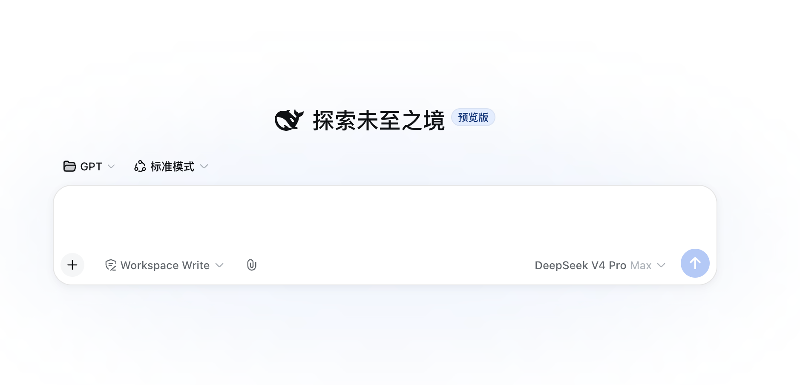

<div align="center">

[English](README.md) | [简体中文](README.zh.md)

</div>

<p align="center">
  
</p>

# dsh-files

一个包，一行 cordis 配置。Web UI 多一个回形针，模型多一个读文档的工具，还能把图片直接交给任何支持视觉的模型。

> **这是踏雪寻仙 DeepSeek Harness 插件矩阵的一员**，主打是 [argo](https://github.com/taxueseek/argo)（给 Agent 的搜索基础设施），同门还有：[dsh-snippets](https://github.com/taxueseek/dsh-snippets)（片段收藏夹） · [dsh-healthcheck](https://github.com/taxueseek/dsh-healthcheck)（只读体检） · [dsh-plugin-guard](https://github.com/taxueseek/dsh-plugin-guard)（插件安全审计） · [taxue-dsh-artisan](https://github.com/taxueseek/taxue-dsh-artisan)（提示词反推与多供应商生图）—— 完整插件栏目见[个人主页](https://github.com/taxueseek#deepseek-harness-%E6%8F%92%E4%BB%B6)

<p align="center">
  
</p>

DeepSeek Harness 双面插件（dual-face plugin）。三项能力：

- **上传**：输入框工具栏回形针按钮、文件夹按钮、页面任意位置拖拽；`@` 文件候选；按会话隔离存储到 `<会话工作区>/.dsh-filess/<sessionId>/`，TTL 定期清扫，sha256 内容去重
- **图片原生支持**：上传的 JPEG / PNG / WebP / GIF 走 harness 核心附件管线（`ctx.attachments` → 请求时转 base64 `image_url`），任何声明支持 image 模态的模型都能真正看到图片，用官方原生图片 rail 呈现
- **文档读取**：`read_document` 工具读取文本 / PDF / DOCX / XLSX，内容嗅探判定真实格式（不信任扩展名），编码回退、分页读取、XLSX sheet 级访问、LRU 解析缓存、协作取消

## 功能

### 上传

- **三种入口**：输入框工具栏**回形针按钮**选择文件（多选），或旁边的**文件夹按钮**选择整个目录（浏览器递归展平、按子目录层级保留相对路径），或直接把文件/文件夹**拖到页面任意位置**（拖拽悬停有遮罩提示）；批量上传有界并发（4），逐文件失败不阻塞其余文件

<p align="center">
  
</p>

- **文件夹批量上传**：选中或拖放一个文件夹时，目录项被递归展平，子目录层级保留在会话上传目录内，并按下限并发逐文件上传——整个文件夹的内容一次到位
- **`@` 双源候选**：输入 `@` 同时列出本会话已上传的文件（绝对路径）与会话工作区文件（相对路径，agent 按其 cwd 解析），无需重新上传即可引用已有工作区文件
- **浮动彩色卡片**：按**字节嗅探的真实格式**着色（PDF 红 / DOC 蓝 / XLS 绿 / TXT 灰），伪装文件（exe 改 .pdf）不按扩展名显示；文件名、大小、移除按钮
- **发送联动**：卡片挂载后文件路径自动注入输入框，随消息发出
- **安全护栏**：loopback host + same-origin + sec-fetch-site 三重校验；`trustedHosts` 支持公网域名 / 反向隧道部署（裸 host 匹配任意端口、`host:port` 精确匹配，与官方 `--trusted-host` 栅栏同语义）；文件名消毒（控制字符、路径分隔、点段、前导点剥离，按 UTF-8 字节截断并**按码点对齐**，emoji 等 astral 字符不会切出孤立代理，长中文名不触发 ENAMETOOLONG）；未知会话 403；并发限流（默认 4）超限 429；超大请求体提前拒绝并排空，keep-alive 不挂起
- **体量提示**：上传响应带 `readHint`（cost / estimatedChars），读前可预判成本
- **生命周期管理**：TTL 清扫（默认 7 天），空会话目录自动回收；可选会话存储配额（`maxUploadBytesPerSession`，超限 507）；sha256 内容去重（同内容不同名只存一份）

### 图片原生支持

- 上传的栅格图片（JPEG / PNG / WebP / GIF）不再落成本地路径让 `read_document` 干瞪眼，而是走 harness 核心附件管线：`createDraftImages` 注册为 composer 草稿图 → `addImages` 进输入区 → 发送时 `serializeDraftImages` 转 base64 `image_url` 经提供方适配器给模型
- **任何支持视觉的模型都行**：因为线格式是供应商中立的 base64 `image_url`，凡是声明 `inputModalities: [text, image]` 的模型（DeepSeek 视觉版、Dots3、龙猫、OpenRouter 视觉模型等）都能真正看图——不限于 DeepSeek
- **原生 UI**：图片由 harness 官方 `conversation.input.attachments` rail 渲染——缩略图、点开大图、原生移除——看起来就是原生 UI，而不是灰色 badge 卡片。dsh-files 不注入该槽位，只把图片交给核心，由官方组件呈现

<p align="center">
  
</p>

### 文档读取

- 内容嗅探：PDF 头 / ZIP 中央目录成员 / UTF-8（fatal）/ UTF-16 BOM / UTF-16 无 BOM / GB18030，全部从字节判定，扩展名伪装（可执行文件、图片改成 .pdf）一律拒绝；上传侧同步嗅探，卡片显示真实格式
- 编码链：UTF-16 BOM → UTF-8（fatal，拒 NUL）→ GB18030（fatal）→ UTF-16 无 BOM（高置信度守卫），中文 GBK 与无 BOM UTF-16 文件均可读
- 分页读取：行号 + offset/limit 分页，长文档按需翻页；窗口字符预算按格式**差异化分级**（text 满额、xlsx 3/4、pdf/docx 1/2，见 `maxOutputChars`），超限截断并显式标记剩余行数，引导模型翻页增量
- 行号策略按格式分化：text（代码/配置）带行号供精确定位；PDF/DOCX/XLSX 段落流不带行号（省 token）
- XLSX sheet 级读取：`sheet` 参数指定工作表时返回该 sheet 全量（不受行截断限制），其余 sheet 走合并读取（默认前 5 个），截断显式标记；`list_sheets` 参数先列出全部 sheet 名（不读单元格），越界报错附带可用 sheet 列表
- 超时可配置：`read_document` 单次执行超时 `readTimeoutMs`（默认 120s），大 PDF 解析不再依赖硬编码
- 扫描件明示：无文本层的 PDF（扫描件/纯图片）返回显式提示而非空串，模型不会误判为空文件
- 解析缓存：LRU 双约束（条目数 + 字节预算），键为 `(targetKey, 内容 sha256, format, sheet, listSheets)`，**内容变化必然失效**（而非仅文件版本）
- 大小预检：`stat` 先查，超限直接报 `FS_TOO_LARGE`，不读字节
- 协作取消：解析期间监听执行信号，用户取消/会话关闭立即中止
- 阅读克制：systemPrompt 引导「先探结构、再精准读、读够就停」，把上下文预算留给任务推理
- 输出呈现：工具结果通过 `presentationMeta` 投影为 `card: 'read'`，Web UI 复用官方读文件卡片（行号/高亮/滚动），模型侧只收紧凑行文本

## 安全

- 解析依赖全部为无已知漏洞的维护中库：`pdfjs-dist`（Mozilla 官方）、`mammoth`、`read-excel-file`（纯只读）
- ZIP 中央目录探测不展开任何成员，成员数与成员名长度均有上限，恶意归档安全拒绝
- 文件读取走 `ctx.fs`，继承会话沙箱与 fs 观察策略，与内置 read 工具同权
- 上传内容不做格式白名单强制（默认全允许），由会话沙箱兜底

## 安装

脚本安装（自动检查 dsh/pnpm 环境，通过 git 通道安装）：

```sh
curl -fsSL https://raw.githubusercontent.com/taxueseek/dsh-files/main/install.sh | sh
# 重启 dsh web
```

手动等价命令（Windows 在 Git Bash 中运行）：

```sh
dsh plugin --profile web add git+https://github.com/taxueseek/dsh-files.git
# 重启 dsh web
```

> npm 上名为 `dsh-files` 的包目前是无关第三方占位包，请勿通过裸 npm 包名安装——只用上面的脚本或 git 命令。

## 配置

```yaml
- id: upload-toolkit
  name: 'dsh-files'
  config:
    maxFileBytes: 25165824        # 单次文档读取字节上限
    readLimit: 800                # 单次返回行数上限（默认 800，翻页成本低）
    sheetRowLimit: 200            # 每个 sheet 保留行数
    maxSheets: 5                  # 每个工作簿读取的 sheet 数
    cacheEntries: 16              # 解析缓存条目数
    cacheMaxBytes: 67108864       # 解析缓存字节预算
    maxOutputChars: 24000         # 单次输出窗口字符预算（text 满额；xlsx 3/4；pdf/docx 1/2，超限截断并标记）
    readTimeoutMs: 120000         # read_document 单次执行超时（大 PDF 解析可加大）
    uploadMaxBytes: 25165824      # 单次上传字节上限
    allowedExtensions: []         # 上传扩展名白名单（空 = 全部允许）
    uploadTtlMs: 604800000        # 上传文件保留时长（7 天）
    sweepIntervalMs: 3600000      # 清扫间隔
    maxConcurrentUploads: 4       # 并发上传数
    maxUploadBytesPerSession: 0   # 每会话存储配额（0 = 不限）
    uploadDir: /abs/path          # 无 sessions 服务时的回退上传根目录
    trustedHosts: []              # 额外信任的上传 Host，如 dsh.example.com 或 dsh.example.com:443（裸 host 匹配任意端口）；默认空 = 仅回环（127.0.0.1/localhost/[::1]）
```

`trustedHosts` 与 `dsh web --trusted-host` 同源语义：通过公网域名 / 反向隧道（Caddy、frp）部署时，浏览器 Origin 是 `https://域名` 而上游已终结 TLS，主服务栅栏放行但上传栅栏的 loopback-only 检查会静默 403（旧版回形针点了没反应）。把部署域名加进 `trustedHosts` 后上传恢复正常；Origin 校验只比较 host 部分，兼容上游 TLS 终结。

## 开发

```sh
pnpm install
pnpm test          # 上传 / 解析 / 缓存回归
pnpm build         # esbuild 打包客户端 bundle
npx tsc --noEmit   # 类型检查
```

## 许可

MIT
